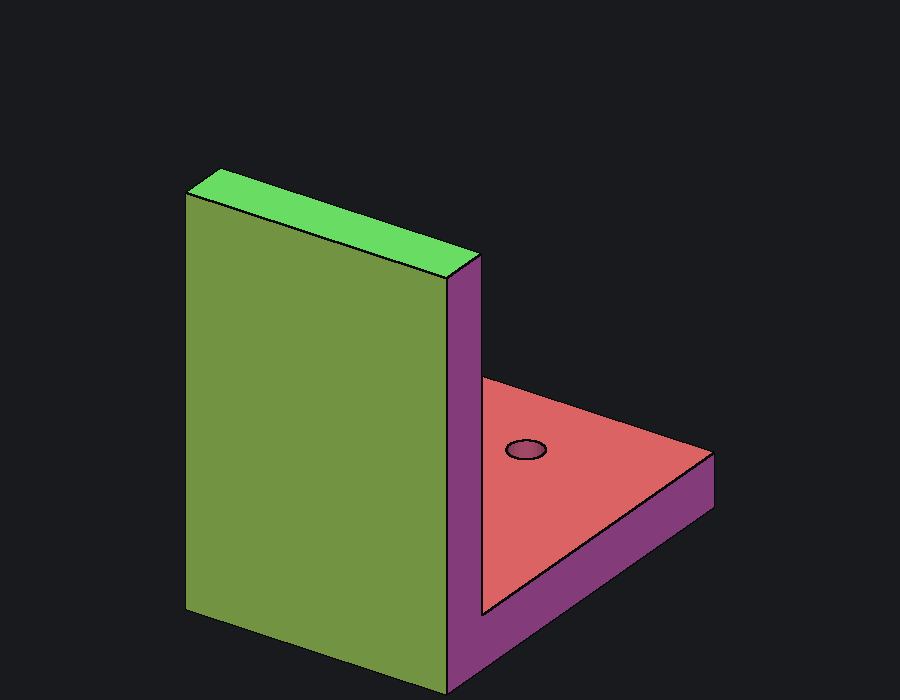
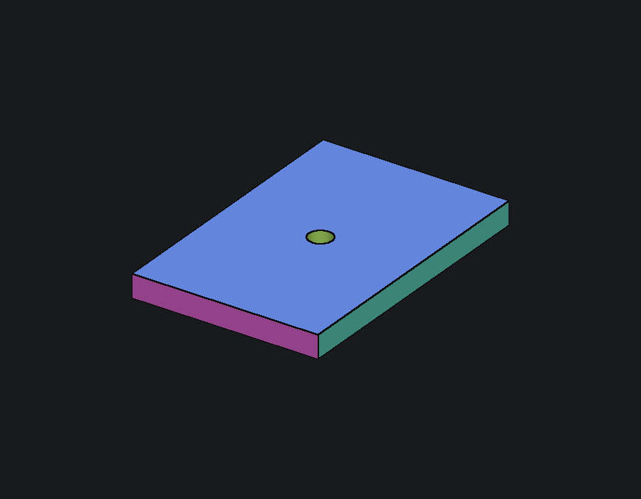
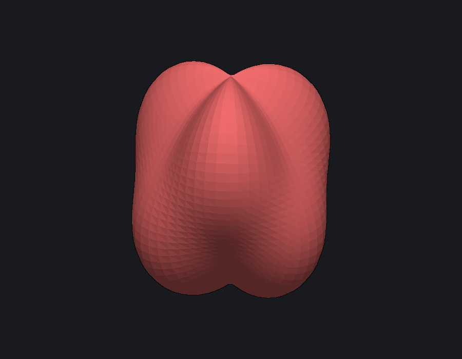
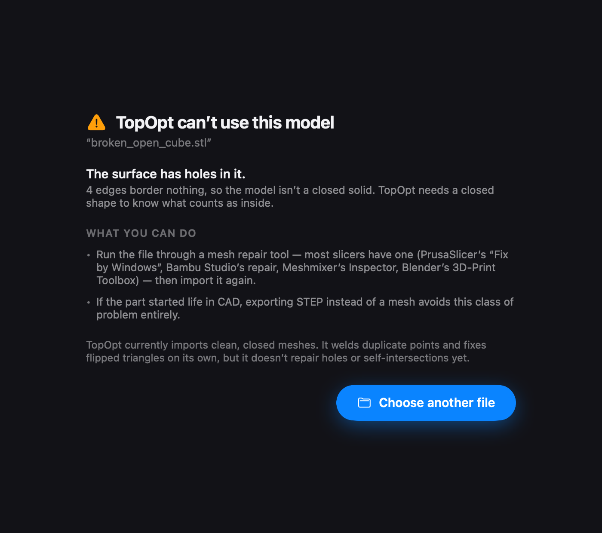
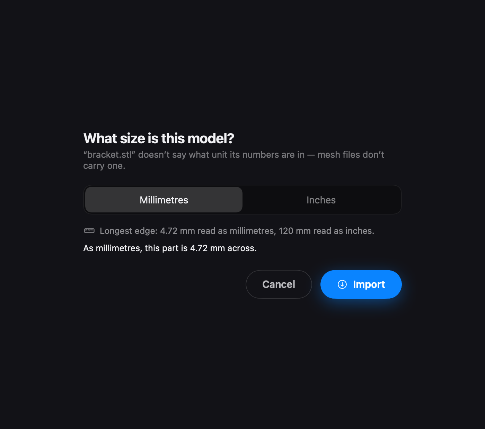

# 134 — STL/3MF import, Phase 1 (pseudo-faces make a mesh selectable)

**Track:** app + bridge + core `io/`. **Territory:** `core/include/topopt/`,
`core/src/io/`, `core/tests/`, `app/TopOptKit/Sources/{TopOptBridge,TopOptKit,
TopOptFlows}`, `app/TopOptKit/Tests`. **No solver change, no optimizer change.**

**Handoff number:** `docs/handoffs/` tops at 133 in this worktree, so this takes
**134**. ⚠️ A concurrent lane (the LAN E2E `stub_cli.py` / re-attach work) also
took **134** the same day in a different worktree. Same situation as the two
committed `131-*` files and the 121 pair: the number collides, the slug does
not. This one is `134-stl-3mf-import-phase-1`.

**Gates (all green):**
* full `ctest` **64/64** (62 pre-existing + `mesh_segmentation` +
  `segment_vs_step`), 773 s — `evidence/134/ctest_raw.txt`
* `swift test` **681 tests, 0 failures, 1 skipped**, 79 s (was 659 before this
  work) — `evidence/134/swift_test_tail.txt`
* the core also builds and links with **OCCT disabled**, which is the point of
  §3 below.

---

## 0. What was actually wrong

An STL imported fine and was then **inert**. The whole downstream flow — tap
selection, anchor/load groups, keep-clear, protect, the design box, the
optimizer — is keyed on a **face id**, carried by `StepModel::triangle_face` +
`StepModel::faces`. A triangle soup has no faces, so the bridge returned
`face_ids = {}`, `face_count = 0`, every tap ray resolved to `nil`, and there was
no way to say where the load goes.

So Phase 1 is not "add an STL reader" — that reader has existed since M1.3. It is
**manufacture the faces an STL doesn't have, and prove they are the same
contract.**

## 1. The contract, kept literally

Every downstream consumer takes a `const StepModel&` — `tag_step_face`,
`mask_step_face`, `mask_clearance_region`, `build_production_loadcase`, the job
schema. That made the adapter a one-liner in shape:

```
.step/.stp  ──OCCT B-rep──────────────────▶  StepModel   (REAL faces, untouched)
.stl        ──read + repair + segment────▶  StepModel   (PSEUDO-faces)
.3mf        ──read + weld + repair + seg─▶  StepModel   (PSEUDO-faces)
```

`topopt::import_part_file(path)` (`core/src/io/part.cpp`) is that adapter, and it
is a drop-in for `import_step_file` — same signature shape, same return type.
**Not one downstream file was changed to accommodate meshes.** The four bridge
call sites simply now call it.

`PartModel::pseudo_faces` records which source was used. It is display-only —
nothing branches on it, because the entire claim is that a pseudo-face and a
B-rep face behave identically.

### The segmenter

`core/src/io/segment.cpp` — maximal regions whose edge-adjacent neighbours meet
across a shallow dihedral angle, then a per-region plane/cylinder fit producing
the same `StepFaceInfo` the STEP importer produces (so keep-clear gets a real
bore axis + radius on an STL, and face clearance gets a real outward normal).

**Determinism** is a hard requirement — pseudo-face ids are persisted in a
project and must survive re-import. Every choice is pinned: seeds in ascending
triangle order, FIFO frontier, fixed edge order, adjacency in ordered `std::map`
(no hash seed), ids handed out in seed order. Asserted twice — same mesh twice,
and same **file bytes** re-imported twice (`test_segment.cpp`,
`TopOptKitTests.testPseudoFaceIDsAreDeterministicAcrossReimports`).

Eigen-free and OCCT-free by construction (it hand-rolls a 3×3 Jacobi
eigensolver), because it must compile into the dependency-free iOS slices.

## 2. The threshold: 35°, and where the bound actually comes from

Sweep: `evidence/134/threshold_sweep.txt`, reproducible via
`cmake --build core/build --target segment_evidence`.

On the three reference meshes the region count is **flat from 20° to 60°** — on
real parts this choice is nowhere near knife-edge. So the window's ends had to be
found with synthetic cases that pull in opposite directions:

| case | 25° | 30° | 35° | 40° | 45° | 50° | wanted |
|---|---|---|---|---|---|---|---|
| 12-gon cylinder (30°/facet) | 14 | 9 | **3** | 3 | 3 | 3 | 3 (barrel is one face) |
| 45° chamfered box | 7 | 7 | **7** | 7 | 7 | 5 | 7 (chamfer is its own face) |

Lower bound: strictly above 30° or barrels shatter. Upper bound: at most 45° or
chamfers get swallowed. **Admissible window (30°, 45]; shipped 35°**, inside it
with margin on both sides.

### The known caveat, stated and pinned as a test

A curved surface tessellated **coarser than ~10 facets per revolution** turns
more than 35° per facet, so its barrel fragments into facet-sized pseudo-faces.
Concrete example, asserted in `test_segment.cpp` so it cannot rot: an **8-gon
prism (45°/facet) yields 10 regions** — 8 barrel strips + 2 caps — instead of 3.
Raising the threshold to absorb it would start eating real chamfers (see the
table), so the segmenter takes the fragmentation. A user who hits this sees
several narrow strips where they expected one bore wall.

## 3. Face tagging escaped its OCCT cage (the one structural change)

`tag_step_face` and `mask_step_face` use **no OCCT** — only `StepModel` and the
voxel grid. They lived in the OCCT-gated `src/io/step.cpp` purely because STEP
was once the only source of faces. They moved verbatim to the always-built
**`src/io/face_tag.cpp`**.

That unlocked two gates that were over-conservative:

* `src/cli/loadcase.cpp` was gated `OpenCASCADE_FOUND AND Eigen3_FOUND`; it never
  used an OCCT symbol, only those two functions. Now gated on **Eigen only**.
* three bridge functions (`tag_step_face`, `mask_step_face`,
  `run_minimize_plastic_loadcase`) were wholly inside
  `#ifdef TOPOPT_BRIDGE_HAS_OCCT` with "requires OpenCASCADE" stubs. The
  `#ifdef`s are **gone**; a `.step` path on an OCCT-free slice still fails, with
  the core's own message raised from `import_part_file` and surfaced through
  `err`.

**Consequence:** an STL/3MF part now runs the *entire* load-case pipeline on the
iOS slices, which are built OCCT-free today. Not asserted — **linked**: the core
was configured with `-DCMAKE_DISABLE_FIND_PACKAGE_OpenCASCADE=ON`, `bridge.cpp`
compiled *without* `-DTOPOPT_BRIDGE_HAS_OCCT`, and a probe calling all six of
`import_part` / `inspect_part` / `rescale_part` / `tag_step_face` /
`mask_step_face` / `run_minimize_plastic_loadcase` links and runs clean
(`evidence/134/occt_free_link_proof.txt`).

## 4. Segmentation quality — measured against ground truth, not judged

The strongest evidence available doesn't rely on anyone's eye. The demo
**L-bracket exists as a STEP file with real B-rep faces**. Tessellate it, write
it out as STL (exactly what a user does exporting a mesh from CAD), re-import
through the *mesh* path, compare:

```
SEGMENT-VS-STEP l-bracket: B-rep 10 faces (8 plane, 2 cyl, 0 other)
                         | pseudo 10 faces (8 plane, 2 cyl, 0 other)
```

Both bolt bores recovered at **r = 2.500 mm** with axes parallel to the B-rep's.
Committed as the ctest `segment_vs_step` (OCCT-gated), so it stays true.

### The three reference meshes

Rendered coloured by pseudo-face with region boundaries drawn (black):

| | mesh | result |
|---|---|---|
|  | **CAD-exported STL of a project part** (l-bracket.step → STL) | 10 faces, 8 plane + 2 cylinder — identical to its own B-rep |
|  | **printables-style bracket** — 60×40×5 plate, sharp outline, M5 bore | 7 faces: top, bottom, bore (r=2.5, axis +z), and four sides at exactly ±x/±y |
|  | **organic blob** — everywhere-curved, 4368 triangles | **1 face** |

ref2 is **authored for this evidence** — it is representative of the geometry
class (flat flanges, sharp outline, cylindrical bore), not a file downloaded from
Printables. Said plainly rather than implied.

**ref3 is the honest limitation.** An organic mesh is one smooth surface, so it
becomes exactly one pseudo-face — which is right (a human wouldn't call any part
of it "that face" either) but means **you cannot select a sub-region of an
organic part**: no anchoring "the flat bottom" of a blob. Selection works, it
just has one thing to select. Region painting / sub-splitting is Phase 2.

### A real bug the reference meshes found

The first ref2 build merged a flat wall with the coarse rounded corner beside it,
and the merged region **fit as a cylinder of r = 139.9 mm on a 60 mm part**. Not
cosmetic: a bolt keep-clear tapped there would have swept a keep-out of that
bogus radius. Fixed with a physical bound — `max_cylinder_radius_span`, default
1.0 × the mesh's bounding-box diagonal. A cylinder bigger than the part is not a
feature of the part.

## 5. Scope honesty: what is refused, and what is repaired

Phase 1 imports **clean, closed, manifold** meshes. Refusals are structured
(`PartInspection` → `PartDiagnostics`), and surface as a **plain-language sheet**,
never a toast and never a crash:



Refused: `NonManifoldEdges`, `OpenBoundary`, `NonOrientable` (inverted normals
beyond repair), `ZeroThickness` (closes topologically, encloses < 1e-6 of its own
bounding box), `EmptyMesh`.

Repaired automatically, because both are unambiguous — and **reported**, since
the user's geometry was changed:
* duplicate-vertex weld (exact coordinate; 3MF does not weld on read)
* normal unification — consistent winding by propagation, then a global flip if
  the enclosed volume came out negative. A wholly inward-wound cube is accepted
  with `flipped_triangles == 12`, not refused.

Both `import_part` (throws) and `inspect_part_file` (reports) run the *same*
`inspect_and_repair`, so the sheet can never disagree with the refusal.

**Explicitly NOT attempted, deferred to Phase 2:** hole filling, self-intersection
resolution, shell thickening, remeshing, non-manifold cutting.

### Units

STL is unitless, so the app asks — mm default, with a size sanity hint:



The answer is applied by writing a **rescaled working copy** once
(`rescale_part_file`). Every later stateless core call then re-reads a file
already in millimetres, which is why **no unit had to be threaded through the
bridge, the job schema, persistence, or the remote-run wire**.

The prompt only recommends when exactly one reading is plausible (1–1000 mm). A
4.72-unit file — the classic inch export — is left **ambiguous on purpose**: 4.72
mm is also a real small part, and the hint shows both numbers rather than
pretending to know. Pinned as a test.

## 6. Contract changes to existing behaviour (read this)

Three existing tests encoded the old contract and were **deliberately updated**,
not worked around:

1. `TopOptKitTests.testImportCubeSTL` asserted `mesh.faceIDs.isEmpty` — "STL has
   no B-rep faces". Now asserts 6 pseudo-faces, all planar. This is the change.
2. `testImportBrokenSTLReportsNotWatertight` → **`…IsRefusedWithADiagnosis`**.
   `importMesh` used to *return* an open mesh with `watertight == false`; it now
   **throws**, and `inspectPart` supplies the structured reason.
3. `AppModelTests.testImportNonWatertightRejectedWithToast` →
   **`testBrokenMeshIsRefusedWithASheetNotAToast`**. The picker now calls
   `pickedFile` (inspect → refuse or ask units) rather than `importFile`.
   `importFile` still fails closed and is kept as the backstop and the STEP path.

## 7. 3MF is code-complete but UNEXERCISED here

The 3MF branch is written and gated on the existing `TOPOPT_HAVE_3MF`, and the
adapter welds 3MF explicitly (lib3mf does not weld on read, unlike the STL
reader). **It was never compiled or run in this environment: lib3mf is not
installed and is not available via Homebrew here.** Treat 3MF as untested until
someone runs it on a machine with lib3mf. STL is fully exercised.

One further 3MF gap, worth naming: the core's `read_3mf_file` **ignores the 3MF
package's `unit` attribute**. That is why the unit prompt is shown for 3MF too
rather than trusting the file. Reading the attribute (and skipping the prompt
when it is present) is Phase 2.

## 8. Files

**New (core):** `include/topopt/segment.hpp`, `include/topopt/part.hpp`,
`src/io/segment.cpp`, `src/io/part.cpp`, `src/io/face_tag.cpp` (moved out of
`step.cpp`), `tests/unit/test_segment.cpp`, `tests/unit/test_segment_vs_step.cpp`,
`tests/tools/segment_evidence.cpp`.

**New (app):** `TopOptFlows/ImportInspection.swift` (pure unit/refusal logic),
`TopOptFlows/ImportUnitSheet.swift` (both sheets),
`Tests/…/ImportInspectionTests.swift`, `Tests/…/ImportSheetCaptureTests.swift`.

**Modified:** `core/CMakeLists.txt`, `core/src/io/step.cpp` (block removed),
`TopOptBridge.hpp/.cpp` (`import_part`, `inspect_part`, `rescale_part`; three
`#ifdef`s removed), `TopOptKit.swift` (`importMesh` unified, `inspectPart`,
`rescalePart`, `PartDiagnostics`), `AppModel.swift` (`pickedFile`,
`resolveUnits`, refusal state), `FlowModels.swift`, `ImportSheet.swift` (3MF in
the picker), `RootView.swift`.

## 9. Phase 2, named

* mesh repair: hole filling, self-intersection resolution, shell thickening
* organic parts: region painting / sub-splitting so a sub-area of one smooth
  surface can be selected (§4)
* read the 3MF `unit` attribute; exercise the 3MF path on a machine with lib3mf
* adaptive threshold, or a per-face split gesture, for coarsely-tessellated
  curved surfaces (§2's caveat)
* the pseudo-face ids are stable per file, but nothing detects that a user
  re-imported a *different* file into an existing project; face ids would then
  silently mean different faces
