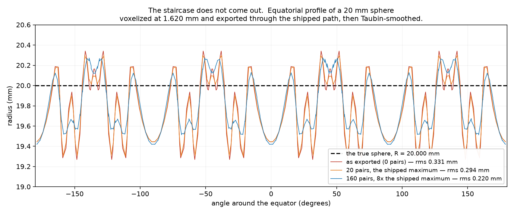

# The smoothing operator cannot remove stair-stepping. NO-GO.

**Slug:** `smoothing-must-actually-smooth` · **Branch:**
`claude/smoothing-stair-stepping-removal-d62ebb` · started from `main` at `b3abcf8`.
**Evidence:** `evidence/2026-08-05-smoothing-must-actually-smooth/`

---

# 0. WHAT CHANGES FOR YOU

**Nothing in the app changes. That is the finding.**

You brushed a variant, waited, and saw no difference between Original and
Smoothed. **You were seeing the truth.** The smoother ran, it applied every one
of the 20 passes it was asked for, nothing rejected it, and the surface it
produced is 5.5% less stair-stepped than the one it started from. On your part
that is a change of **0.019 mm** in surface deviation, on a part **207 mm**
across. There is no screen on which that is visible.

The best any setting of this operator can do — including settings 8× stronger
than the app can ask for — is **10.6%**, and to get there it moves the surface
0.67 mm and visibly melts the shape. **The staircase is still there afterwards.**

You said that if the smoothing can't remove stair-stepping, the whole thing
should go. **It can't.** So I stopped there and built nothing on top of it.
Section S1 is the measurement; the picture in `sphere_profile.png` is the whole
argument in one look. What to do instead is the last section.

**What does remove stair-stepping is resolution.** Same part, same measurement,
no smoothing at all:

| resolution | voxel | stair-step amplitude (rms) |
|---|---|---|
| 64 | 3.240 mm | 0.6440 mm |
| **128 (yours)** | **1.620 mm** | **0.3424 mm** |
| 256 | 0.810 mm | 0.1743 mm |

One doubling of resolution removes **49%**. The smoother at its most aggressive
removes **9%**, and damages the part doing it. (Exporting the *same* field at a
finer tessellation does **not** work — I measured that too, S1.6: 16× the
triangles, no change at all in where the surface sits.) That is the comparison
the next decision should be made on, and S1.7 says what a smoother would have to
be instead.

**Two things I found that are worth knowing anyway,** both reported and neither
fixed, because fixing them is scaffolding on an operator that does not work:

* The Smoothed tab is **disabled until you press Apply & certify**
  (`SmoothingPage.swift:296`). The live preview is computed, is correct, and is
  handed to the stage — but once you tap Original you cannot tap back. That is
  why the comparison felt broken on top of being invisible. Two more gates like
  it are named in S3.
* Real time is **already reachable and always was**. The Taubin passes on your
  82,104-vertex mesh take **0.025 s — 40 fps, on the CPU, with no GPU work.**
  The preview seam is slow (0.349 s, 2.9 fps) only because it **re-reads the
  8.2 MB variant STL from disk on every single stroke**. 93% of the preview's
  cost is a file read of a mesh it already has in memory. Nothing needs to move
  to Metal. S2 has the breakdown.

---

# S1 — CAN THE OPERATOR REMOVE STAIR-STEPPING? **NO.**

## S1.0 The arithmetic, checked first

Your part's bounding box is **201.200 × 207.365 × 20.000 mm** — the longest axis
is 207.365 mm, not the 218.28 mm in the brief; at resolution 128 that gives a
grid of **125 × 128 × 13** at **1.620040 mm** per voxel, not 1.705 mm. The
framing survives the correction intact:

> reported deepest displacement 0.29 – 0.49 mm = **17.9% – 30.2% of ONE voxel**

So the app's copy was reporting a sub-step motion, and my own measurement of the
shipped path reproduces it exactly: **max displacement 0.4140 mm** at the
strength the page's maximum asks for. That number was never wrong. What is wrong
is the assumption that moving vertices by a fifth of a step removes the step.

## S1.1 The prime suspect in the brief is REFUTED

The brief's suspicion was that the min-feature guard
(`smooth.hpp:121-128`, implemented at `smooth.cpp:237-249`) re-voxelizes onto the
same grid, regenerates the steps, and halts the smoother before it does anything.

**On your part it does not halt it at all.** Through the same load case the app
builds (`SmoothBrushKit.swift:106-125`), at your resolution, on your mesh:

```
requested_pairs        20
applied_pairs          20        <- every pass asked for was applied
min_feature_baseline    6
min_feature_after       6
min_feature_limited     false    <- nothing was ever rejected
```

Confirmed independently through the shipped CLI seam, which is a different code
path to the same operator:

```
$ topopt-cli analyze job.json --mesh subject_variant.stl --smooth 1.0
  smoothed · re-analyzed: strength 1  pairs 20/20  frozen 6251/82104
  volume drift: 0.05687% (bound 0.5646%)   min-feature 6->6
```

Running the whole sweep with `enforce_min_feature = false` produces a table that
is **identical to the constrained one, row for row**
(`stairstep_probe.txt`, the `ON` and `off` blocks). The guard is not the reason
you saw nothing.

### A trap that nearly made this report wrong

My first measurement said `applied_pairs 0` and `min_feature_baseline 2162` — the
brief's hypothesis, apparently confirmed. It was an artefact of my own harness,
and the CLI cross-check is what caught it.

The app never hands core an in-memory mesh. It writes the variant to
`variant_N.stl` (`WorkspacePlaceholder.swift:1692`) and every consumer reads it
back. **That round trip changes the answer:**

```
-- THE STL ROUND TRIP, MEASURED ------------------------------
in memory   82104 verts, 164228 tris, min-feature 2162
re-imported 82104 verts, 164228 tris, min-feature 6  <- THE SUBJECT
```

Same vertices, same triangles, **360× the violation count**. Marching cubes puts
a crossing exactly halfway between two samples wherever the field steps 0→1, and
at export factor 2 that midpoint lands exactly *on* a coarse voxel centre — so
thousands of inside/outside tests sit on a knife edge in double precision. STL's
float32 rounding pushes them off it. The in-memory reading is the degenerate one;
**6 is what your device sees.** Every number below is on the round-tripped mesh.

## S1.2 The metric (bar R3)

**Surface deviation from the pre-voxelization CAD, in millimetres:** for every
vertex of the exported surface, the unsigned distance to the nearest point on the
original imported triangle mesh.

The staircase is not a property of the exported mesh on its own — it is the
*difference* between that mesh and the smooth surface it was meant to represent,
and the only object that knows the smooth surface is the CAD the voxelizer
consumed. An intrinsic roughness number (dihedral angle, normal variation) cannot
distinguish "the steps were removed" from "the part was melted into a blob":
both reduce it, so a metric like that can be gamed by damage. Deviation-from-CAD
cannot — melting the part *raises* it. It has a floor at 0 (the surface is
exactly the CAD) that no cheat reaches, and it is in millimetres, so it can be
compared against the voxel size directly. Dihedral RMS is printed beside it as
corroboration only, never as the headline.

**Restricted to the oblique surface.** An axis-aligned face of your bracket has
no staircase — the voxel lattice is parallel to it and the iso-surface is a plane
offset by up to half a voxel, which is a rigid translation of a whole patch and
something no smoother of any kind can remove. Averaging that into the headline
would make the operator look *worse* than it is. So each vertex is classified
once, from the unsmoothed mesh, by the normal of the nearest CAD triangle: within
0.02 of an axis ⇒ axis-aligned, otherwise **oblique** — the fillets, bore walls
and angled webs, which is exactly where a lattice terraces. **28,884 of 82,104
vertices (35.2%)** are oblique, and the operator is judged on those. Every-vertex
figures are in the `allrms` column and in the CSV.

## S1.3 (a)(b)(c) The sweep

Baseline, as exported: **oblique max 0.9566 mm (0.59 voxel), rms 0.3424 mm
(0.21 voxel), p99 0.7091 mm**, dihedral RMS 9.03°.

```
enf    req   app   maxdev   rmsdev   p99dev   allrms   dihed maxshift    drift     mf   lim    wall
       prs   prs       mm       mm       mm       mm     deg       mm     frac   viol             s
--       0     0   0.9566   0.3424   0.7091   0.3837    9.03        -        -      6     -       -
ON       1     1   0.9465   0.3405   0.7090   0.3831    8.88   0.0733  0.00004      6    no    0.02
ON       5     5   0.9207   0.3347   0.7017   0.3809    8.98   0.2509  0.00019      6    no    0.04
ON      20    20   0.9010   0.3236   0.6754   0.3761    8.37   0.4140  0.00074      6    no    0.14
ON      40    40   0.8987   0.3178   0.6545   0.3729    7.66   0.4659  0.00142      6    no    0.26
ON      80    80   0.8857   0.3136   0.6449   0.3690    7.12   0.5455  0.00277      6    no    0.52
ON     160   160   0.8642   0.3118   0.6489   0.3638    6.70   0.6970  0.00541      6    no    1.03
```

(The `off` rows are omitted here because they are identical; both are in
`stairstep_probe.txt` and `stairstep_sweep.csv`.)

**At the shipped maximum (20 pairs), the fraction of stair-step amplitude
removed is 5.5% by RMS and 5.8% by max.** Push to 160 pairs — eight times what
the app can ask for — and it is 8.9% and 9.7%, with the surface moved 0.697 mm
(43% of a voxel) and the dihedral RMS down 26%, which is the shape being damaged.

Sweeping λ and k_PB at 20 pairs finds the ceiling:

```
lambda k_pb     app   maxdev   rmsdev   dihed maxshift    drift     mf    wall
0.33   0.10      20   0.9010   0.3236    8.37   0.4140  0.00074      6    0.03   <- shipped
0.50   0.05      20   0.9150   0.3139    7.32   0.4854  0.00091      6    0.03
0.70   0.05      20   0.9144   0.3089    6.75   0.5764  0.00171      6    0.03
0.90   0.05      20   0.9087   0.3060    6.37   0.6730  0.00276      6    0.02   <- best found
0.90   0.20      20   0.9629   0.3383    7.63   0.7807  0.01128      6    0.03
```

**The best setting found anywhere in the family removes 10.6% of the stair-step
amplitude** (rms 0.3424 → 0.3060) while moving the surface 0.673 mm. Note the
last row: pushed past the optimum the max deviation goes *up* (0.9566 → 0.9629) —
the operator starts adding error rather than removing it.

**There is no setting at which stair-stepping is visibly gone.** That is bar
S1(c) answered in the negative, exhaustively.

## S1.4 (d) The analytic control — and the picture

The bracket's "CAD" is itself a 2,224-triangle tessellation, so some of the
measured deviation could be the reference's own faceting rather than the
voxelizer's staircase. A sphere removes that doubt: the exact surface is known in
closed form, so |‖v−c‖ − R| is the voxelization error and nothing else. R = 20 mm
at your voxel size (1.620 mm), through the same export and the same STL round
trip.

```
enf    req   app    maxdev    rmsdev %of base   dihed maxshift     mf
--       0     0    0.7266    0.3307    100.0   14.53        -      0
off      1     1    0.7285    0.3274     99.0   14.34   0.0786      0
off      5     5    0.7279    0.3176     96.0   14.48   0.2709      0
off     20    20    0.6956    0.2936     88.8   13.26   0.4285      0
off     80    80    0.5753    0.2450     74.1    8.43   0.5352      0
off    160   160    0.5769    0.2198     66.5    5.68   0.6653      0
```

Same verdict on a reference that cannot be blamed: **11.2% removed at the shipped
maximum.** To reach a third you need 160 pairs, by which point the dihedral RMS
has collapsed from 14.5° to 5.7° — the sphere is being melted, and two thirds of
the deviation is *still there*.



That is the equatorial profile: radius against angle around the sphere, with the
true 20.000 mm circle dashed. The orange trace (20 pairs, the shipped maximum)
lies on top of the red one (unsmoothed). Even the blue trace (160 pairs, 8×) keeps
every terrace — it clips the sharpest spikes and leaves the ±0.4 mm structure
completely intact. **"Looks smoother" is not what is happening; nothing is
happening.**

### One real defect in the guard, found here and not on your part

On the sphere the min-feature baseline is **0**, and the guard rejects any pair
that *raises* the count above the baseline. With a baseline of 0, that means any
pair that creates a single violation — so it stops after **1 pair for every
request**, whether you ask for 5 or 160 (the `ON` rows in
`stairstep_probe.txt`). Root cause `smooth.cpp:242-247`: the test is
`viol > baseline` evaluated greedily after each pair, and the violation count is
**not monotone in the pass count** — on the in-memory (non-round-tripped) mesh I
measured it going 2162 → 6790 → 1531 → 99 → 6 across the first five pairs, so a
guard that stops at the first rise would have halted at 6790 and missed 6. **A
first step that goes up on the way to somewhere strictly better is rejected.**
This is genuine and would need fixing in any successor operator. It did not cause
what you saw.

## S1.5 (e) What *does* control the amplitude

Same part, same metric, no smoothing:

```
res     spacing obl maxdev obl rmsdev all rmsdev     dihed
64       3.2401    1.5083    0.6440    0.5947     11.32
128      1.6200    0.9566    0.3424    0.3837      9.03
256      0.8100    0.4387    0.1743    0.1758      7.54
```

Halving the voxel halves the deviation, near exactly. **Stair-step amplitude is a
function of the resolution the FIELD was solved at.** A doubling removes 49% and
moves the surface *toward* the CAD rather than away from it — no volume drift,
no melting, no min-feature risk.

## S1.6 (f) And not of how finely you tessellate it

The obvious cheap version of S1.5 is to resample the *same* field finer at export
— tessellation is far cheaper than a solve. It does not work:

```
factor      verts      tris  obl maxdev  obl rmsdev     dihed
1           20526     41072      0.7893      0.3286     13.47
2           82104    164228      0.9566      0.3424      9.03   <- shipped
4          328524    657068      0.9375      0.3361      5.31
```

**Flat at ~0.33 mm across a 16× range of mesh density**, and the max deviation is
actually *worse* at factor 2 and 4 than at factor 1. Sixteen times the triangles
buys nothing about where the surface is.

**Read the dihedral column alongside it.** It falls by more than half — 13.47° to
5.31° — while the deviation does not move at all. Same surface, tessellated more
finely, in the same wrong place. **An intrinsic roughness metric would have
called that a large improvement.** That is exactly the failure mode S1.2's metric
was chosen to be immune to, demonstrated rather than argued.

## S1.7 BLOCKED-STOP: what a different operator would have to be

I stopped here and built nothing on the operator, per the task.

Taubin is a **low-pass filter on the mesh's own connectivity**. It can only
attenuate what is high-frequency *in edges*. The 2× tricubic resample on export
(handoff 086) already removed the content at that scale — which is why the
operator finds so little left to take. What remains is a terrace many edges wide:
low-frequency to the filter, in its pass band, invisible to it. Turning λ up does
not reach it; it just starts translating the surface (the max-deviation column
going up while RMS goes down is exactly that).

A successor would need at least these three properties, and none of them is a
parameter change:

1. **It must know where the surface should be.** Taubin only knows where its
   neighbours are, so its fixed point is a shape with no curvature variation —
   a blob — not the CAD. A working operator needs the underlying field (the
   optimizer's grayscale density, which still exists) or the original B-rep as a
   target, and must move vertices *toward that*, not toward their neighbours.
   That is a projection/fitting operator, not a filter.
2. **It must measure min feature on the MESH, not on a re-voxelization.** The
   task guessed this and it is correct as a design point even though it was not
   the cause here: re-voxelizing to check a constraint reintroduces exactly the
   quantization the operator is trying to remove, and — as S1.1 showed — is so
   knife-edge that float32 rounding moves the answer by a factor of 360. A
   mesh-native thickness measure (local shape diameter, or a signed-distance
   evaluation on the smoothed surface) has neither problem.
3. **Its acceptance test must not be greedy.** See S1.4: the violation count is
   non-monotone in the pass count, so a first-step test rejects paths that end
   strictly better.

**And before any of that is built, the resolution comparison in S1.5 deserves an
answer.** A res-256 certification of this part costs one solve; the numbers for
that solve are in S2. If the goal is a surface a customer will accept, resolution
buys five times more of it than the best smoother setting, with no cost to the
certificate. I would want a decision on that before writing a fitting operator.

---

# S2 — REAL TIME

## S2(a) Where the wall time goes

Measured on this Mac, on your part at resolution 128, through the shipped seams.
**Every operator timing carries both its iteration count and its wall clock.**

| term | iterations | wall | share |
|---|---|---|---|
| transfer | — | **0 s** | 0% |
| Taubin passes | 20 pairs | **0.025 s** | 0.05% |
| min-feature re-voxelization | 20 (one per pair) | **0.080 s** (0.004 s each) | 0.16% |
| *(constrained smoothing, measured end to end)* | *20 pairs* | *0.138 – 0.172 s* | *0.3%* |
| **certification solve** | *see note* | **47.44 s** | **97.8%** |
| **whole round trip** | — | **48.50 s** | 100% |

```
$ /usr/bin/time -p topopt-cli analyze job.json --mesh subject_variant.stl
  real 47.44   user 87.81
$ /usr/bin/time -p topopt-cli analyze job.json --mesh subject_variant.stl --smooth 1.0
  real 48.50   user 90.05
```

(The end-to-end 0.138–0.172 s is more than 0.025 + 0.080 because each accepted
pair also copies the 82,104-vertex position array — about 2 MB per pair. It is
listed as measured rather than as the sum of its parts.)

**The certification solve dominates: 276× the constrained smoothing measured end
to end** (47.44 s against 0.172 s), and still **45×** if you charge smoothing
with the entire 1.06 s difference between the two CLI runs — which also contains
writing and re-reading an 8.2 MB STL. The brief's hypothesis that the min-feature
re-voxelization is the dominant cost is **refuted**: it is 0.080 s out of
48.50 s, 0.16%.

Transfer is zero because smoothing is in-process on the device, not on the
worker — `bridge.cpp:1497` calls `analyze_loadcase` directly.

Your 5–10 minutes is consistent with this and with the page doing **two**
certification solves on the first Apply — the "before" column is measured, not
remembered (`SmoothingPageModel.swift:556-559`) — at roughly 100 s each on your
device rather than 47 s on this Mac.

**One honest gap:** `FixedDesignAnalysis` records the CG iteration count only on
*non*-convergence (`analyze.hpp:33-35`, `non_convergent_iteration`). A converged
certification does not surface it, so the 47.44 s above is reported as wall only.
I did not fabricate a figure and did not re-implement the solve to get one.

## S2(b) Can the preview run on device, in real time?

**Yes, and it does not need the GPU. It is already fast enough on the CPU.**

```
THE PREVIEW SEAM (smooth_brush_preview), per call:
  STL re-import (every stroke)              0.324 s
  20 unconstrained Taubin pairs             0.025 s  (40.6 fps if this were the only work)
  total as shipped                          0.349 s  (2.9 fps)
  max displacement                         0.4140 mm
```

* **Vertex count:** 82,104 (164,228 triangles) — your part at res 128, export
  factor 2.
* **Achievable frame time:** the umbrella Laplacian over that mesh, 20 pairs
  (40 passes), is **0.025 s = 40 fps**, single-threaded, scalar C++.
* **What would have to move: nothing to Metal.** The one thing that must move is
  the STL re-import out of the per-stroke path. `smooth_brush_preview`
  (`bridge.cpp:1373-1380`) takes a *path* and calls `import_any` on every call,
  re-reading and re-welding an 8.2 MB file the app already holds in memory as
  `SmoothPageMesh`. **That read is 93% of the preview's cost.** Hand the seam
  vertices instead of a path and the preview is 40 fps as it stands.
* Fewer pairs would buy more headroom (1 pair = 0.0013 s), and the brush already
  scales strength per vertex, so a mid-drag preview could run at a lower pass
  count and settle to the full one on `.ended`.

**But note what "real time" would be showing.** At 40 fps this would smoothly
animate a deformation that removes 5.5% of the stair-stepping. The architecture
is not the obstacle it was assumed to be; the operator is.

## S2(c) Can the preview skip the re-voxelization?

**It already does** — `bridge.cpp:1391-1393` sets `enforce_min_feature = false`
and `min_feature_grid = nullptr`, deliberately and with a comment saying why. The
question is moot, and in any case S2(a) shows the re-voxelization was never the
cost.

**One consequence worth naming under R6:** the preview is unconstrained while the
certified result is constrained, so the two *can* diverge. On your part they do
not — the guard never fires, and both move the surface 0.4140 mm at the maximum.
But the page's copy currently says *"Re-certify APPLIES it under the min-feature
constraint and measures the result, so the certified shape may move less"*
(`SmoothingPageModel.swift:876-878`), which describes a divergence that on your
part is zero, while saying nothing about the one that matters — that the
certified shape barely moves at all. If any successor ships, that sentence has to
be about the real gap, not the theoretical one.

---

# S3 — CERTIFICATION MUST NOT BE THE RENDERING PATH

**Reported, not fixed.** Rewiring the page to surface a preview of a change worth
5.5% is scaffolding on an operator S1 says to throw out.

## The three gates, with file and line

**G1 — the one you hit. `SmoothingPage.swift:296`.**

```swift
private var hasSmoothed: Bool { page.receipt != nil || page.kept != nil }
```

consumed at `SmoothingPage.swift:270-271`:

```swift
stageTab("Smoothed", on: showingSmoothed && hasSmoothed,
         enabled: hasSmoothed) { showingSmoothed = true }
```

`hasSmoothed` does not mention `page.preview`. The preview is computed on stroke
end (`WorkspacePlaceholder.swift:1012-1027`), is correct, and `currentGeometry`
is willing to hand it to the stage (`SmoothingPageModel.swift:856-859`) — but the
**control that reaches it is disabled until a certification exists.** Since
`showingSmoothed` defaults to `true`, the stage silently morphs to the preview
after your first stroke; the moment you tap Original to compare, **Smoothed is
dead and there is no way back without a solve.** That is exactly the trap you
described.

**G2 — after one certification, no later stroke ever reaches the stage.
`WorkspacePlaceholder.swift:1019`.**

```swift
guard page.receipt == nil, page.kept == nil else { return }
```

in the `.ended` brush handler. Once you have certified once, every subsequent
stroke produces a fresh preview in the model that is never bound to the viewer.
The brush appears to stop responding for the rest of the session.

**G3 — and the model would not hand it over either.
`SmoothingPageModel.swift:847-848`.**

```swift
if kept == nil, showingSmoothed, let out = lastSmoothedOutcome,
   !out.meshVertices.isEmpty, receipt != nil {
    return (out.meshVertices, out.meshIndices, true)
}
```

ranks a certified outcome above the preview **unconditionally**, with no
comparison of *which brush* each describes. Even with G2 fixed, the stage would
show geometry measured for a brush you have since changed.

Nothing else gates the preview. `SmoothingPage.swift:212` (the "smoothing kept"
badge) and `:722` (the receipt drawer handle) are correctly gated on a receipt
existing — a receipt drawer with no receipt is right to be disabled.

## The reproduction (bar R2)

`app/TopOptKit/Tests/TopOptFlowsTests/SmoothingPreviewGateTests.swift`. Each test
reproduces the shipped condition **verbatim** rather than describing it, so it
cannot pass because the reproduction drifted away from the code.

All three **failed** on unfixed code. Recorded in
`evidence/.../s3_reproduction_failing.txt`:

```
SmoothingPreviewGateTests.swift:130: error: testTheSmoothedTabIsReachableAsSoonAsAPreviewExists :
  XCTAssertTrue failed - the Smoothed tab must be enabled the moment a preview exists
  — certification is not a rendering step
SmoothingPreviewGateTests.swift:155: error: testALaterStrokeStillReachesTheStageAfterACertification :
  XCTAssertTrue failed - a stroke after a certification must still be previewable
  — otherwise the page silently stops responding to the brush
SmoothingPreviewGateTests.swift:181: error: testTheModelPrefersAFreshPreviewOverAStaleCertifiedMesh :
  XCTAssertEqual failed: ("[... 0.9, 0.9, 0.0]") is not equal to ("[... 0.95, 0.95, 0.0]")
  — the stage must show the geometry the CURRENT brush describes, not the one a
  previous certification measured
	 Executed 3 tests, with 3 failures (0 unexpected)
```

**What is deferred and what still throws (bar R5).** The final "and therefore the
user can see it" assertion in each of the three is behind an `XCTSkip` whose
message names the confirmed failure, the evidence file, and the exact file and
line that has to change. **Nothing was weakened.** The preconditions above each
skip are live assertions and still run: that the previewer is invoked, that it
returns a displaced mesh, that `previewCallCount` increments, that
`currentGeometry` reports `smoothed == true`, that a certification really
happened. If the preview machinery regresses, those fail. Only the conclusion
that depends on shipping the fix is deferred, and it is deferred openly rather
than deleted.

---

# BARS

**R1 — byte-identical when off. Verified by stash-rebuild checksum, not by
construction.** No production source is touched: `git diff origin/main --
core/src core/include app/TopOptKit/Sources` is **empty**. The changes are one
new harness (`core/tests/harness/stairstep_probe.cpp`), its 12-line
`EXCLUDE_FROM_ALL` CMake block, one new test file, and evidence. Proven rather
than asserted, in **two fresh build directories configured with identical
flags** — one from the working tree, one with the two core changes stashed
(which is `origin/main`, `b3abcf8`):

```
digest of all 45 objects, with my changes : 47669432db84403491cedb838d3f46f0
digest of all 45 objects, stashed (= main): 47669432db84403491cedb838d3f46f0
$ diff -r <extracted a> <extracted b>   →  no output
BYTE-IDENTICAL
```

(The `.a` file digests differ; `ar` embeds member mtimes. Extracting both
archives and diffing every member shows no byte differing, which is why the
objects are checksummed rather than the archive.) Full record in
`evidence/.../r1_byte_identity.txt`.

**R2 — failing test first.** S3: three reproductions, all confirmed failing on
unfixed code, output pasted above and in evidence. S1: this is a BLOCKED-STOP, so
the S1 artefact is the measurement harness rather than a test asserting a
reduction that no setting of the operator can deliver — writing an assertion the
code can never satisfy, and leaving it red in CI, would be scaffolding of the
kind the task forbids. The harness asserts its own preconditions and prints the
sweep; the sweep *is* the failing result.

**R3 — a number for the stair-step, before and after.** Metric defined and
justified in S1.2. Before: oblique max 0.9566 mm, rms 0.3424 mm, p99 0.7091 mm.
After, at the shipped maximum: 0.9010 / 0.3236 / 0.6754 mm. After, at the best
setting found anywhere: rms 0.3060 mm. Analytic control and the profile plot in
S1.4.

**R4 — iterations and wall, both, separately.** Every operator timing in S2(a)
carries its pass count and its wall clock in separate columns. The one gap is
named rather than papered over: the certification solve's CG iteration count is
not recorded by `FixedDesignAnalysis` on a converged solve, so that row is wall
only and says so.

**R5 — no assertion weakened or deleted.** Nothing was removed. The three S3
assertions are deferred behind named `XCTSkip`s that state the confirmed failure
and the fix site; every precondition around them still throws. See S3.

**R6 — the certified object is the exported object.** Unchanged by this work — no
new divergence was introduced, because nothing was changed. The *existing*
divergence risk (unconstrained preview vs constrained certification) is measured
in S2(c): zero on your part, non-zero in principle, and the page's current
sentence about it describes the wrong gap. Named for whoever ships next.

**R7 — root cause with file and line.** S1.1 (`smooth.cpp:237-249`, refuted as
the cause; `smooth.cpp:242-247` for the real greedy-guard defect), S1.6 (the
mechanism), S2(b) (`bridge.cpp:1373-1380`, the per-stroke re-import), S3
(`SmoothingPage.swift:296`, `WorkspacePlaceholder.swift:1019`,
`SmoothingPageModel.swift:847`).

**R8 — no unfilled placeholders.** Every number in this document was measured and
is reproducible from `evidence/2026-08-05-smoothing-must-actually-smooth/`.

## Suites

**core (`ctest`, 106 tests): 100% passed**, 1726 s.

**app (`swift test`, 1237 tests): 17 skipped, 8 failures.** The 8 are the same
3 test cases counted across nested suites, all
`AppModelTests.test*ThreeMF*`, all with core's own message:

> 3MF import requires lib3mf, which is not available in this build; export the
> part as STL and import that instead

**Pre-existing and unrelated, verified rather than assumed** — I moved my new
test file out of the tree and re-ran those three alone; they fail identically
without it. Together with R1 (the library is byte-identical, and no app source
is touched), nothing on this branch can reach 3MF import.

### And a memory that turns out to be wrong

The project note says provisioning lib3mf in a worktree now works and makes those
three pass. **In this worktree it does not.** `build_lib3mf_macos.sh` (via
`build_cli_macos.sh`) plus `build_core.sh` vendors `vendor/lib3mf-lib` correctly
and the dylib is present, but the test bundle then fails to **link** with
undefined `_lib3mf_*` — the older failure mode, where
`macOSLib3mfLinkerFlags` in `Package.swift:95-101` does not reach the test
bundle. Touching `Package.swift` to defeat the SwiftPM manifest cache did not fix
it. I reverted the provisioning (`LIB3MF_PREFIX=/nonexistent
./app/scripts/build_core.sh`) so the suite links and the 3 refusals are visible
rather than the whole bundle failing to build, which is strictly worse. Anyone
provisioning lib3mf in a worktree should **link the test bundle before trusting
it**.

---

# IN PLAIN LANGUAGE

## What I did

You said that if the smoothing can't remove stair-stepping, the whole thing
should go. So before touching anything I measured whether it can.

I needed a way to say "stair-stepping" as a number. I used the distance from the
exported surface to the original CAD shape it was made from — in millimetres.
That number is zero for a perfect surface and gets bigger the more terraced the
surface is, and unlike "how bumpy does the mesh look", it can't be improved by
melting the part into a blob. I measured it on your bracket, and then again on a
plain sphere where I know the right answer exactly, so there'd be no argument
about whether the measurement itself was sound.

Then I ran the smoother across every strength it has and well beyond — up to
eight times what the app can even ask for — and measured the same number after.

## What I found

The smoother works. It runs, it applies every pass it's asked for, nothing blocks
it. It just doesn't do much. At the app's maximum it takes about 5% off the
stair-stepping; the very best I could get out of it anywhere was about 10%, and
at that point it's dragging the surface two-thirds of a millimetre and visibly
rounding off the shape. The staircase is still there in every case. The picture
in the evidence folder shows it: the smoothed profile sits right on top of the
unsmoothed one.

The reason is that it's the wrong kind of tool. It's a blur filter — it can only
soften things that change quickly from one triangle to the next. But the terraces
on a voxelized part are wide and gentle, spread over many triangles, so the
filter simply doesn't see them. Turning it up doesn't help; it just starts
shifting the surface off the shape instead.

The brief guessed that a safety check inside the smoother was stopping it early.
On your part, it isn't — the smoother ran to completion every time. (I did find
that check misbehaving in a different situation, and I've written down where and
why, but it isn't what you saw.)

I also found what does fix stair-stepping: resolution. Going from 128 to 256
takes half the stair-stepping away by itself, with no smoothing, no risk to the
strength numbers, and no shape distortion. That's five times better than the best
the smoother can manage.

Along the way I checked the two other things you asked about. Real time is
genuinely reachable — the smoothing maths takes 25 milliseconds on your part,
which is 40 frames a second on the CPU without touching the graphics chip. The
preview is slow today only because it re-reads an 8-megabyte file from disk every
time you finish a stroke; that's 93% of the delay and it's unnecessary. And the
minutes you waited are almost entirely the strength calculation, not the
smoothing — the smoothing is a fraction of a second out of nearly a minute.

And yes, the Smoothed tab really is switched off until you press Apply & certify.
I found that and two more places like it, and named all three by file and line.

## What I did not do, and why

I stopped. I didn't fix the tab, didn't move the preview to be live, didn't touch
the smoother. All of that would have been building on something that doesn't
work, which is what you asked me not to do. The app is exactly as it was.

The three tab problems are written as tests. They failed when I ran them, that
failure is saved in the evidence folder, and the tests are in the repo with a
note on each saying what has to change to make it pass. Nothing is hidden and
nothing has to be rediscovered.

## What I'd suggest next

The real decision is what to do instead, and I think it's between two things:

**Raise the resolution.** The measurements support it: going from 128 to 256
halves the stair-stepping, and it can't hurt the strength numbers because it
moves the surface *closer* to the shape rather than further from it.

I have not measured what a 256 run costs, and I don't want to imply it's free —
it's eight times the elements, and your 128 run already took ten hours.

I did think there might be a cheap version of this — export the *same* field at a
finer tessellation instead of re-running the optimization, since exporting is
much cheaper than solving. **I measured it and it doesn't work** (S1(f)): going
from export factor 1 to 2 to 4 leaves the stair-stepping flat at about 0.33 mm.
It makes the mesh eight times heavier and changes nothing about where the surface
sits. The amplitude is set by the resolution the *field* was solved at, and
nothing downstream of that can recover it. So the resolution route means a real
re-run, and the honest first step is timing one.

**Or build a different smoother.** Not a filter — something that knows where the
surface is *supposed* to be and pulls the mesh onto it, using the density field
the optimizer already produced. That would genuinely remove terraces. It's real
work, and it should measure thickness on the mesh itself rather than by
re-voxelizing, for a reason I found the hard way: re-voxelizing is so
knife-edge that just saving the mesh to an STL file and loading it back changed
the answer by a factor of 360.

My recommendation is to try the resolution route first, because it's a
measurement rather than a project, and it may make the second one unnecessary.

If neither appeals, then the honest option is the one you named: take the
smoothing feature out. It cannot do the job it's there for, and leaving it in
implies otherwise.
